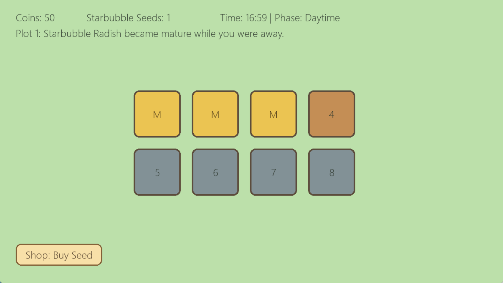
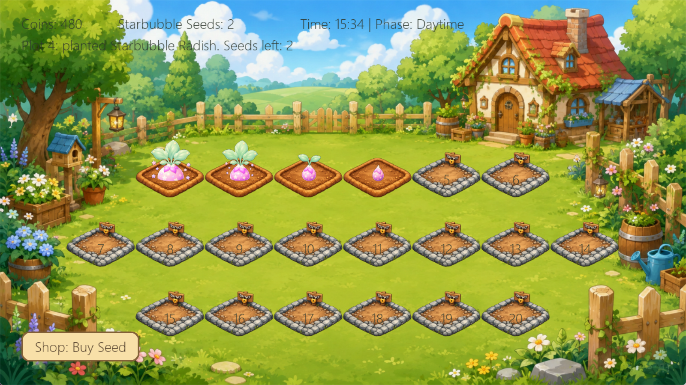
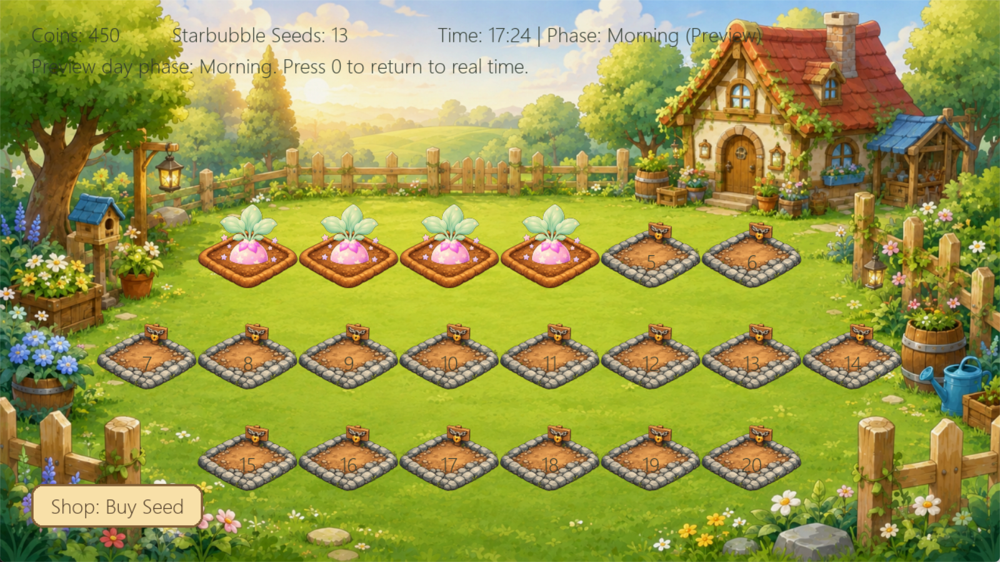
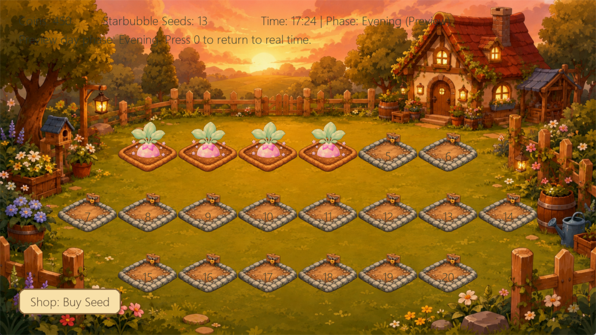
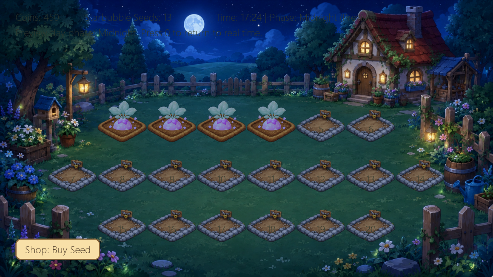
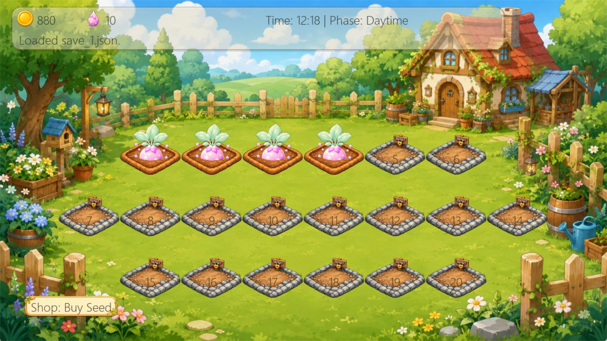

# 咕噜小菜园 Gulu Garden

《咕噜小菜园》（Gulu Garden）是一款使用 Python + Pygame 开发的可爱休闲种菜经营游戏。

玩家可以在自己的小菜园中购买种子、播种、等待作物成长、收获并获得金币。游戏使用现实时间驱动作物成长，即使关闭游戏，作物也会根据真实经过时间继续成长。

本项目是一个长期个人游戏开发项目，目标是练习 Python / Pygame、积累 GitHub 作品集，并逐步扩展为可以打包分享给朋友试玩的可爱休闲小游戏。

---

## 当前版本

Version 1.5.0 — 背包界面基础版

当前版本已经完成基础种菜闭环、简单任务系统、图鉴基础版、多作物基础版、土地解锁基础版，并加入背包界面基础版：

* 打开 Pygame 游戏窗口
* 显示 20 块农田，采用 6-8-6 交错布局
* 前 4 块土地初始可使用
* 其余土地为 locked 状态
* locked 土地会显示解锁价格
* 点击 locked 土地可以花费金币解锁
* 支持星泡萝卜、云糖南瓜、月露蘑菇三种作物
* 支持购买多种作物种子
* 支持多作物播种、成长、成熟和收获
* 支持多作物图鉴记录
* 支持现实时间离线成长
* 支持昼夜背景切换与场景素材调色
* 支持简单任务系统
* 支持图鉴基础系统
* 新增游戏内背包面板
* 按 `I` 可以打开或关闭背包面板
* 按 `Esc` 可以关闭背包面板
* 背包面板显示当前金币
* 背包面板显示当前选中作物
* 背包面板显示当前选中作物的种子价格
* 背包面板会提示当前金币是否足够购买种子
* 背包面板显示三种作物种子数量
* 背包面板显示种子总数
* 背包为空时会显示购买提示
* 当前选中作物使用 `>` 标记，避免特殊符号乱码
* 背包面板和图鉴面板互斥显示
* 背包或图鉴打开时，鼠标点击不会穿透到土地或商店
* 背包数据会保存到 JSON 存档
* 重启游戏后种子数量可以恢复

---

## 操作说明

| 操作               | 说明                      |
| ---------------- | ----------------------- |
| 鼠标左键点击空地         | 播种当前选中作物                |
| 鼠标左键点击成熟作物       | 收获作物并获得金币               |
| 鼠标左键点击 locked 土地 | 尝试花费金币解锁土地              |
| 点击商店按钮           | 购买当前选中作物的 1 个种子         |
| 按 `Q`            | 选择星泡萝卜                  |
| 按 `W`            | 选择云糖南瓜                  |
| 按 `E`            | 选择月露蘑菇                  |
| 按 `B`            | 临时测试快捷键：购买当前选中作物的 1 个种子 |
| 按 `S`            | 手动保存游戏                  |
| 按 `T`            | 临时调试快捷键：在终端打印当前任务进度     |
| 按 `I`            | 打开或关闭背包面板               |
| 按 `C`            | 打开或关闭图鉴面板               |
| 按 `Esc`          | 关闭当前打开的面板               |
| 按 `1`            | 预览 Morning 昼夜阶段         |
| 按 `2`            | 预览 Daytime 昼夜阶段         |
| 按 `3`            | 预览 Evening 昼夜阶段         |
| 按 `4`            | 预览 Midnight 昼夜阶段        |
| 按 `0`            | 恢复真实时间昼夜阶段              |
| 点击窗口关闭按钮         | 自动保存并退出游戏               |

---

## 已实现版本

| 版本            | 内容                  | 状态  |
| ------------- | ------------------- | --- |
| Version 0.1   | 项目骨架与基础窗口           | 已完成 |
| Version 0.2   | 农田网格与鼠标点击           | 已完成 |
| Version 0.3   | 星泡萝卜播种与成长           | 已完成 |
| Version 0.4   | 收获与金币循环             | 已完成 |
| Version 0.5   | 商店与种子背包             | 已完成 |
| Version 0.6   | 单存档系统               | 已完成 |
| Version 0.7   | 离线成长提示              | 已完成 |
| Version 0.9   | 昼夜系统基础版             | 已完成 |
| Version 1.0   | 第一个可试玩版本            | 已完成 |
| Version 1.0.1 | 基础视觉素材替换版           | 已完成 |
| Version 1.0.2 | 昼夜背景贴图与场景调色系统       | 已完成 |
| Version 1.0.3 | HUD、商店按钮与基础 UI 贴图替换 | 已完成 |
| Version 1.1   | 简单任务系统基础版           | 已完成 |
| Version 1.2   | 图鉴基础版               | 已完成 |
| Version 1.3   | 多作物基础版              | 已完成 |
| Version 1.4   | 土地解锁基础版             | 已完成 |
| Version 1.5   | 背包界面基础版             | 已完成 |

---

## 当前未实现内容

当前版本暂未实现：

* 多存档槽
* 存档选择界面
* 正式商店面板
* 正式任务栏 UI
* 正式图鉴作物列表
* 背包分类页
* 背包拖拽操作
* 背包物品使用
* 收获作物进入背包
* 作物背包与手动售卖
* 土地等级系统
* 土地升级系统
* 特殊土地类型
* 浇水系统
* 完美品质系统
* 知识锁图鉴解锁
* 昼夜影响作物成长速度
* 昼夜影响完美品质概率
* 昼夜平滑渐变
* 天气系统
* 季节系统
* 动画系统
* 音效系统
* exe 打包发布

---

## 后续计划

下一步建议为 Version 1.6 — 正式商店面板基础版。

Version 1.6 目标：

* 添加简单商店面板
* 商店面板显示多种种子商品
* 显示商品名称、价格和当前拥有数量
* 支持点击不同商品购买对应种子
* 保留当前快捷键购买逻辑作为测试入口
* 不做商品分页
* 不做工具、肥料和装饰商品
* 不做复杂商店动画
* 不做音效

更后续版本：

* Version 1.7：任务栏 UI 基础版
* Version 2.0：完美品质系统
* Version 2.1：知识锁图鉴
* Version 2.2：昼夜影响作物
* Version 2.3：基础动画与音效


---

## 当前作物

| 作物   | 英文名                 | 种子价格 | 收获金币 | 成熟时间 | 定位       |
| ---- | ------------------- | ---: | ---: | ---: | -------- |
| 星泡萝卜 | Starbubble Radish   |   10 |   20 | 30 秒 | 新手基础作物   |
| 云糖南瓜 | Cloud Sugar Pumpkin |   18 |   42 | 50 秒 | 中级稳定收益作物 |
| 月露蘑菇 | Moondew Mushroom    |   30 |   75 | 80 秒 | 高级夜晚主题作物 |

---

土地显示说明：

| 显示   | 含义          |
| ---- | ----------- |
| 数字编号 | 空地或锁定土地     |
| P    | 已播种 planted |
| G    | 生长中 growing |
| M    | 已成熟 mature  |

---

## 游戏截图



当前截图展示了 Version 1.0 候选版本的基础界面，包括金币、种子数量、现实时间阶段、农田格子、商店按钮和作物成长状态。

### Version 1.0.1 视觉素材替换


当前截图展示了 Version 1.0.1 的视觉素材替换效果，包括新的背景图、土地贴图和作物贴图。

### Version 1.0.2 昼夜背景与场景调色








### Version 1.0.3 HUD 与基础 UI 更新



---

## 核心玩法

当前基础循环：

1. 玩家进入游戏。
2. 查看金币和种子数量。
3. 点击 `Shop: Buy Seed` 购买星泡萝卜种子。
4. 点击空地播种。
5. 等待星泡萝卜成长。
6. 作物成熟后点击收获。
7. 获得金币。
8. 继续购买种子并扩展后续玩法。

---


## 技术栈

* Python 3.12
* Pygame
* JSON 本地存档
* Git / GitHub 项目管理

---

## 安装与运行

### 1. 克隆项目

```powershell
git clone https://github.com/CatAlvin/Gulu-Garden.git
cd Gulu-Garden
```

### 2. 创建虚拟环境

```powershell
py -3.12 -m venv .venv
```

### 3. 激活虚拟环境

Windows PowerShell：

```powershell
..venv\Scripts\Activate.ps1
```

### 4. 安装依赖

```powershell
python -m pip install -r requirements.txt
```

### 5. 启动游戏

```powershell
python src/main.py
```

运行成功后，应打开一个 1280 × 720 的 Pygame 窗口。

---

## 项目结构

```text
Gulu-Garden/
├─ README.md
├─ requirements.txt
├─ .gitignore
├─ docs/
│  ├─ game-design.md
│  ├─ version-roadmap.md
│  ├─ asset-guide.md
│  ├─ save-format.md
│  ├─ project-structure.md
│  ├─ development-log.md
│  ├─ ai-prompts.md
│  ├─ version-1.0-release-checklist.md
│  └─ images/
│     ├─ gulu_garden_v1_0_main_window.png
│     ├─ gulu_garden_v1_0_1_visual_update.png
│     ├─ gulu_garden_v1_0_2_morning.png
│     ├─ gulu_garden_v1_0_2_daytime.png
│     ├─ gulu_garden_v1_0_2_evening.png
│     └─ gulu_garden_v1_0_2_midnight.png
├─ data/
│  ├─ crops.json
│  ├─ shop_items.json
│  └─ tasks.json
├─ assets/
│  ├─ images/
│  │  ├─ backgrounds/
│  │  │  ├─ farm_morning.png
│  │  │  ├─ farm_daytime.png
│  │  │  ├─ farm_evening.png
│  │  │  └─ farm_midnight.png
│  │  ├─ crops/
│  │  │  ├─ starbubble_radish/
│  │  │  │  ├─ stage_0_seed.png
│  │  │  │  ├─ stage_1_sprout.png
│  │  │  │  ├─ stage_2_growing.png
│  │  │  │  └─ stage_3_mature.png
│  │  │  ├─ cloud_sugar_pumpkin/
│  │  │  │  ├─ stage_0_seed.png
│  │  │  │  ├─ stage_1_sprout.png
│  │  │  │  ├─ stage_2_growing.png
│  │  │  │  └─ stage_3_mature.png
│  │  │  └─ moondew_mushroom/
│  │  │     ├─ stage_0_seed.png
│  │  │     ├─ stage_1_sprout.png
│  │  │     ├─ stage_2_growing.png
│  │  │     └─ stage_3_mature.png
│  │  ├─ tiles/
│  │  │  ├─ plot_empty.png
│  │  │  └─ plot_locked.png
│  │  ├─ ui/
│  │  ├─ icons/
│  │  └─ effects/
│  ├─ audio/
│  │  ├─ bgm/
│  │  └─ sfx/
│  └─ fonts/
├─ saves/
│  └─ .gitkeep
├─ src/
│  ├─ main.py
│  ├─ config.py
│  ├─ game.py
│  ├─ models/
│  │  ├─ **init**.py
│  │  ├─ crop.py
│  │  ├─ inventory.py
│  │  ├─ player.py
│  │  └─ plot.py
│  ├─ systems/
│  │  ├─ **init**.py
│  │  ├─ save_system.py
│  │  ├─ shop_system.py
│  │  ├─ task_system.py
│  │  ├─ codex_system.py
│  │  └─ time_system.py
│  ├─ ui/
│  │  ├─ **init**.py
│  │  ├─ button.py
│  │  ├─ hud.py
│  │  └─ panel.py
│  └─ utils/
│     ├─ **init**.py
│     ├─ asset_loader.py
│     ├─ constants.py
│     └─ image_tint.py
└─ tests/
└─ test_save_system.py
```


## 存档说明

游戏使用本地 JSON 存档。

默认存档路径：

```text
saves/save_1.json
```

真实存档文件不会提交到 GitHub。仓库中只保留：

```text
saves/.gitkeep
```

---

## 素材说明

当前版本主要使用 Pygame 绘制的占位图形和颜色块。

项目最终美术方向为：

* 高清
* 可爱
* 卡通
* 柔和
* 治愈
* 奇幻小菜园风格

后续会逐步替换为正式图片素材。

---

## 开发日志

详细版本记录见：

```text
docs/development-log.md
```

Version 1.0 发布检查清单见：

```text
docs/version-1.0-release-checklist.md
```
